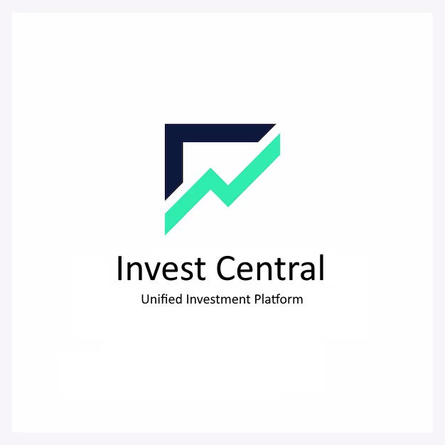

## Projeto - Plataforma de Investimentos
# InvestCentral

  

### Grupo G

### Integrantes:
* [Jhayne Ketleen Henemam Martins](https://github.com/JhayneK)
* [João Victor Miotelli Vitali](https://github.com/JoaoMiotelli)
* [Renato Ribas Campos](https://github.com/RenatoRibas)
* [Laura Silveira](https://github.com/laurassilveirag)

### Descrição do Projeto:

InvestCentral é a plataforma digital definitiva para investidores, oferecendo um espaço centralizado para registrar e gerenciar ações, organizar carteiras de investimento, monitorar em tempo real as alterações de valores, visualizar demonstrativos detalhados por período, e acompanhar o desempenho de seus investimentos, incluindo lucros, perdas e ganhos percentuais, tudo isso com segurança e eficiência, proporcionando insights valiosos e uma experiência de investimento transparente e recompensadora.

### Objetivo do Projeto:

O objetivo principal do "InvestCentral" é abordar a complexidade e o desafio enfrentados pelos investidores ao gerenciar múltiplos ativos e acompanhar o desempenho de seus investimentos em diferentes plataformas ou interfaces. Ao oferecer uma solução centralizada, o "InvestCentral" busca simplificar o processo de monitoramento e gestão de investimentos, proporcionando ao usuário uma visão clara e consolidada de sua carteira. A plataforma visa eliminar a necessidade de alternar entre diversas ferramentas ou realizar cálculos manuais, facilitando decisões informadas, promovendo eficiência e, consequentemente, otimizando os retornos para o investidor. Ao fazer isso, o "InvestCentral" aspira a ser a ferramenta essencial para todo investidor que deseja uma experiência de investimento mais organizada, transparente e lucrativa.

### Estrutura do Projeto:

### Tela de Login:
Campo para inserção de usuário ou e-mail.
Campo para senha.
Botão "Entrar".

### Carteira:
Formulário para inserção de novas ações: código da ação, quantidade, valor pago, data da compra.
Lista das ações já cadastradas com opções para editar ou excluir.

### Portfólio:
Formulário para nomear e criar novas carteiras.
Lista de carteiras já criadas com resumo de valor e opção para adicionar ações a elas.
Lista das ações com campo para atualização do valor atual.
Opção para registrar a data e hora da atualização.

### Tela de Demonstrativo de Valores:
Seleção de período para visualização (ex: diário, semanal, mensal).
Gráficos e tabelas exibindo desempenho das ações e carteira no período escolhido.

  * Tela de Visualização do Total Investido:
    * Valor numérico total investido.
    * Lista detalhada de cada ação e seu respectivo valor de compra.
  
  * Tela de Visualização do Total Lucrado:
    * Valor numérico total do lucro.
    * Lista detalhada de cada ação, seu valor atual e o lucro ou perda em relação ao valor de compra.
    
  * Tela de Perdas:
    * Lista de ações que estão no negativo, mostrando a quantidade e o valor da perda.
    
  * Tela de Percentual de Ganhos:
    * Gráfico ou indicador mostrando a porcentagem de ganho em relação ao valor total investido.
    * Lista detalhada de cada ação e seu respectivo percentual de ganho ou perda.

### Publico Alvo:
"InvestCentral" é voltado para:
* ### Novatos: 
  * Pessoas que estão começando a investir.
* ### Investidores habituais:
  * Quem já investe e quer otimizar a gestão.
* ### Especialistas em finanças: 
  * Profissionais que buscam análise aprofundada.
* ### Estudantes: 
  * Aprendizes buscando prática no mercado.
* ### Pequenas empresas: 
  * Negócios iniciando no mundo das ações.

A plataforma busca ser versátil, atendendo desde o iniciante até o especialista.

### Tecnologias, bibliotecas e frameworks:

 Neste projeto iremos usar React com Vite.js.
